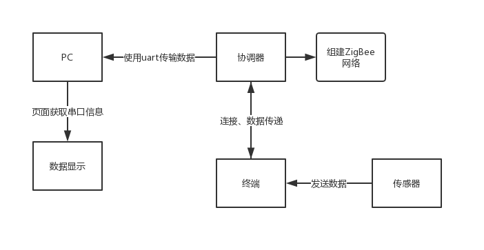
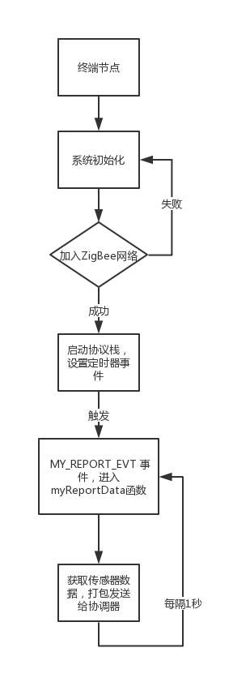
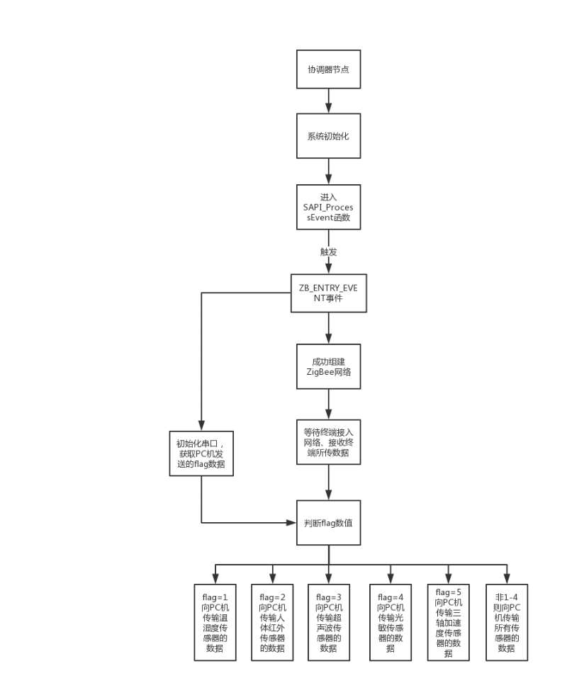
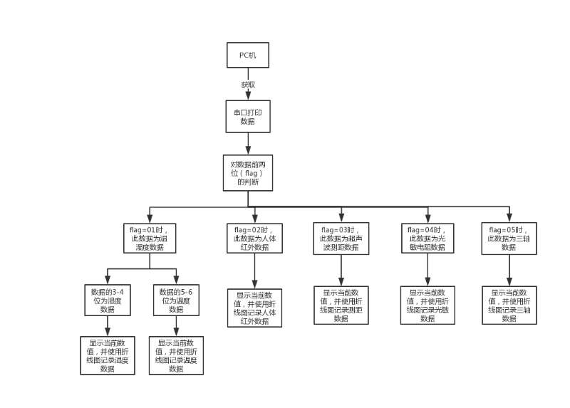
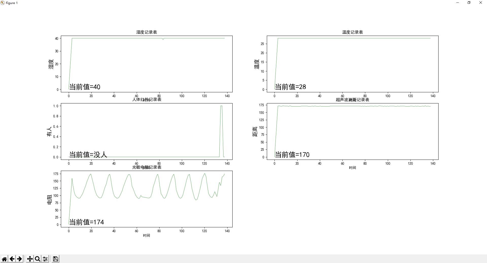
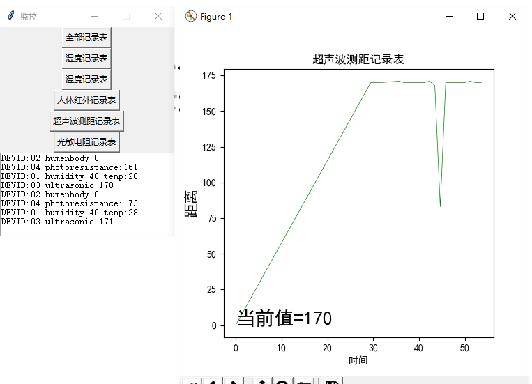

# 1. zstack-cc2530
 基于cc2530的嵌入式

### 1.0.1. 目  录
<!-- TOC -->autoauto- [zstack-cc2530](#zstack-cc2530)auto        - [目  录](#目--录)auto    - [前言](#前言)auto    - [开发工具](#开发工具)auto    - [系统结构(整体)设计](#系统结构整体设计)auto    - [功能实现](#功能实现)auto    - [运行结果及分析](#运行结果及分析)auto    - [改进](#改进)autoauto<!-- /TOC -->
 
## 1.1. 前言
当前无线传感技术已经被认为实在最重要的研究之一。无线传感器网络节点的稳定运行是整个网络可靠性的重要保障，同时传感应用是当下热门的智能家居的一个重要技术之一，智能家居的数据收集几乎全靠传感器去操作。本次设计的系统将会使用中智讯公司开发的 s210 系列实验平台搭载 ZXBee 系列 Zigbee 无线模块以及温湿度传感器. 人体红外检测. 超声波测距和光敏传感器，利用无线通信的技术把不同传感器的数据处理后，利用串口把数据传输到用户界面，为用户实时提供当前环境的情况。

## 1.2. 开发工具
### 1.2.1. 硬件工具
	温湿度传感器模块 
	人体红外检测模块 
	超声波测距 
	光敏传感器 
	中智讯公司开发的 s210 系列实验平台 

### 1.2.2. 软件工具
	IAR Embedded Workbench for 8051 9.10 
	C语言开发 
	Python开发UI界面 

## 1.3. 系统结构(整体)设计
### 1.3.1. 系统总设计

 

#### 1.3.1.1. 系统总设计流程图

本系统采用了温湿度传感器模块. 人体红外感应模块. 光敏电阻传感器模块. 超声波测距模块以及ZigBee模块。可以实现节点自组网. 对周围环境的温湿度数据的采集. 采集光线的强弱. 根据热量检测是否有人靠近. 超声波测试物体当前所在的距离等功能。不同功能的传感器终端通过收集自身的数据，先通过无线传感技术把数据发送到协调器，协调器根据终端数据的标识判断是什么传感器的数据，再通过Uart串口技术把数据重新发送到用户电脑上，根据数据类型显示在相应的数据区域内。

## 1.4. 功能实现
### 1.4.1. 传感器终端功能实现

 

 
### 1.4.2. 终端功能实现流程图

ZigBee模块通过自组网技术组成一个数据传输网络，温湿度传感器收集当前环境的温度和湿度的数据. 光敏电阻根据当前光照的强弱改变自身电阻的阻值. 人体红外感应通过感应是否有人靠近. 超声波测距通过发出的超声波碰到障碍物后反弹回来的时间差来计算物体的距离。终端在和协调器组网成功后就会自启动协议栈，根据用户自定义事件去执行相关函数功能获取相关传感器的数据，传感器每隔1秒刷新数据，获取数据后再通过zb_SendDataRequest(0, ID_CMD_REPORT, 6, dat, 0, AF_ACK_REQUEST, 0 )函数发送数据给协调器，以下是各个终端上的传感器模块进行数据采集功能的实现方法的简单说明，详细内容请看代码文件。 
1. 温湿度传感器模块终端：该模块通过协议栈封装的unsigned char dht11_temp(void)函数以及unsigned char dht11_humidity(void)函数分别获取温度和湿度的数据，该传感器的数据标识设置为01。 
2. 人体红外传感器终端：该模块通过收集P0_5管脚的电平高低变化来判定当前有没有人靠近，该传感器的数据标识设置为02。; 
3. 超声波传感模块终端：该模块通过协议栈封装unsigned int srf05Distance(void)函数获取距离数值，该传感器的数据标识设置为03。 
4. 光敏电阻模块终端：  该模块通过协议栈封装好的 getADC()函数获取阻值变化的大小来反映刚找的强弱，该传感器的数据标识设置为04。 
5. 三轴加速度传感器模块：该模块传感器通过与MCU之间的数据处理是经过I2C总线通行。 

### 1.4.3. 调器功能实现

 

4.2.1协调器功能实现流程图

协调器系统初始化后开始创建网络以及初始化串口准备与PC机传输数据；等待有终端加入网络后，协调器开始与终端进行数据传输，协调器接收到终端发送过来的数据后，根据接收到的数据标识进行相关的数据处理后再通过串口Uart发送到PC机上的用户界面显示；此外用户可根据电脑上的串口助手发送数字1. 2. 3. 4分别筛选显示温湿度数据. 人体红外数据. 超声波测距数据和光敏数据。
### 1.4.4. 用户界面设计	

4.3.1用户界面流程图
## 1.5. 运行结果及分析

### 1.5.1. 系统运行总效果图

 
### 1.5.2. 单一传感器效果图

数据解读：
1. 温度记录表的当前值为当前环境的温度为28摄氏度； 
2. 湿度记录表的当前值为当前环境的湿度为40； 
3. 人体红外记录表中的当前值如果为1 则表示有人靠近，为0表示无人； 
4. 超声波测距记录表的当前值表示物体与传感器的距离为170厘米； 
5. 光敏电阻的当前值为阻值的大小，阻值越小表示当前光照越强； 
6. 三轴加速度的当前值代表X. Y. Z轴的重力加速度 

## 1.6. 改进
此系统还需要进一步研究和改进的是： 
1. 添加省电和紧急模式，前者可以在平时减少发送信息的频率，极大的延长了终端传感器的使用时间，减少维护成本，后者可以在数据出现异常时候增加发送信息的频率，让用户更加直观看到当前状态 
2. 由于时间关系,我们没有添加校验信息的功能，导致我们如果信息传输错误时候会导致系统的重启，后期我们将会改进这个细节。 
3. 改善用户上位机的软件界面，提供用户更加人性化和美观的操作方式。 
4. 因为时间关系，我们没有添加长时间的旧数据记录，接下来我们将会采用数据库记录信息，可以实现超长时间的数据记录。 

